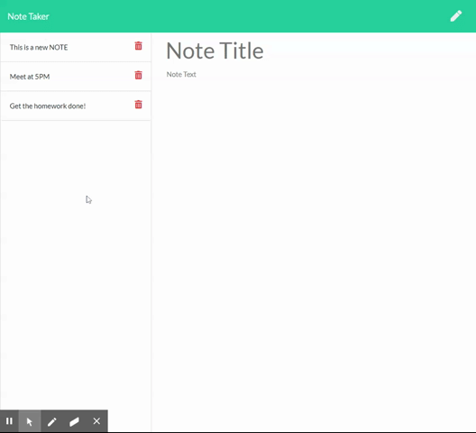

# Note Taker
   

This is application starts with a home page. Click the "Get Started" button to open the Notes page.  This simple notes application is easy to use utilizing Nodejs, Express and MySql to serve the application.  The trash can next to the list of notes enables the notes to be removed.

## Use and Image
Visit https://note-taker-very-basic.herokuapp.com/ to use a demo of the application.
   

## Dependencies
- Nodejs
- - Express
- - Path

## Installation
- Fork or copy the repository to a computer with Nodejs installed.
- From a terminal command run 'npm install' in the directory of the app.
- start the server, 'node server.js'
- open a browswer.  In the address bar, enter 'https://localhost:5000'. 

## Learning
Starting to make my code more moduler and DRY.  Continuing to improve making the code DRY with the appropriate amount of psuedo code included to explain the intent of the functionality.

To enable note deletion, I reassign the id to each element. Then use that ID to splice the note from the array.

JavaScript
```

app.get('/api/notes', (req, res) => {
    fs.readFile(dbJson, 'utf8', (err, data) => {
        if (err) throw err;

        let note={};
        notes = [];
        let notesParsed = JSON.parse(data);

        for (let i = 0 ; i < notesParsed.length; i++) {
            note = notesParsed[i];
            note.id = i;
            notes.push(note);
        };
     
        res.json(notes);
        });    
});


```

Here we use the same ID to delete the note from the db file.

```

app.delete('/api/notes/:id', function(req, res) {
    notes.splice(req.params.id,1);
    fs.writeFileSync(dbJson, JSON.stringify(notes));
    res.json(notes);
});


```
    
## Technologies Used
- HTML and CSS
- JavaScript
- Nodejs
- Express

## Authors
#### Michael Downs
[LinkedIn](http://www.linkedin.com/in/michaeldownssj)  
[GitHub](https://chindowns.github.io/) 
